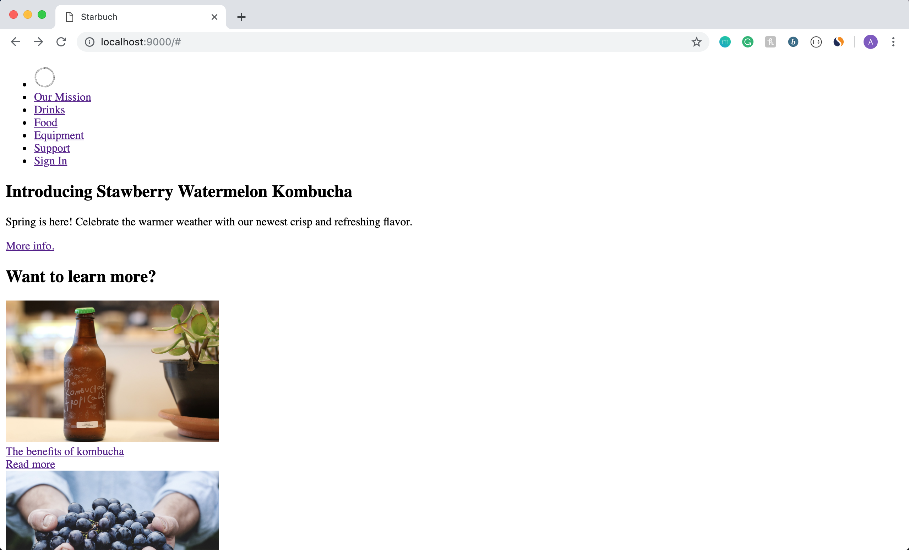
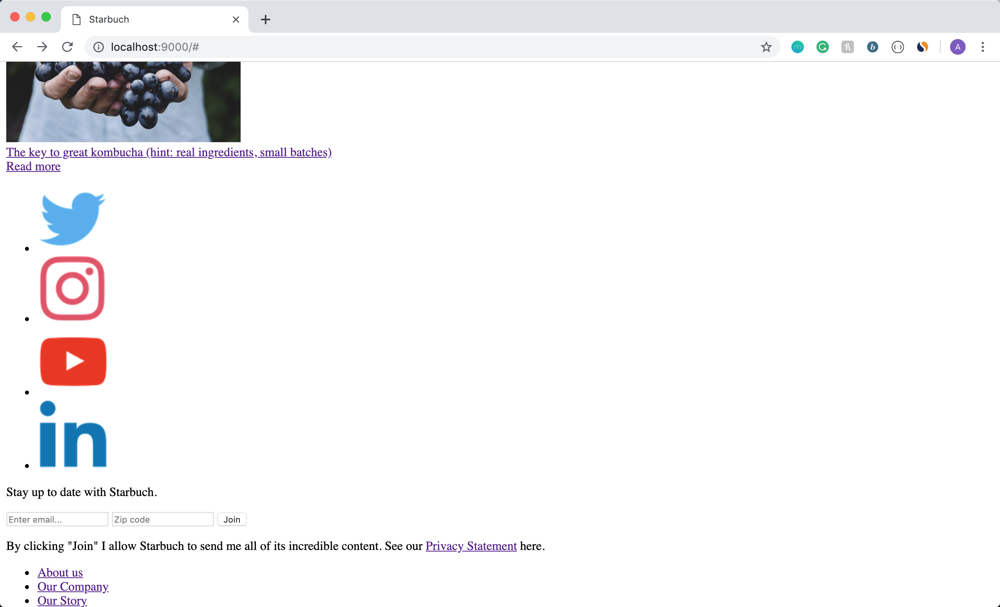
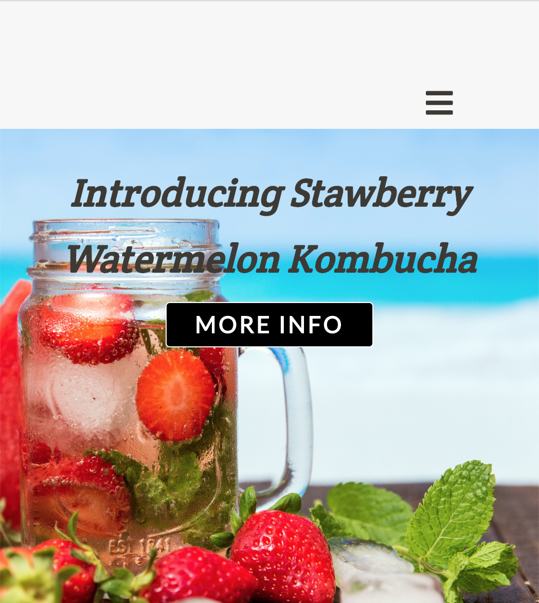
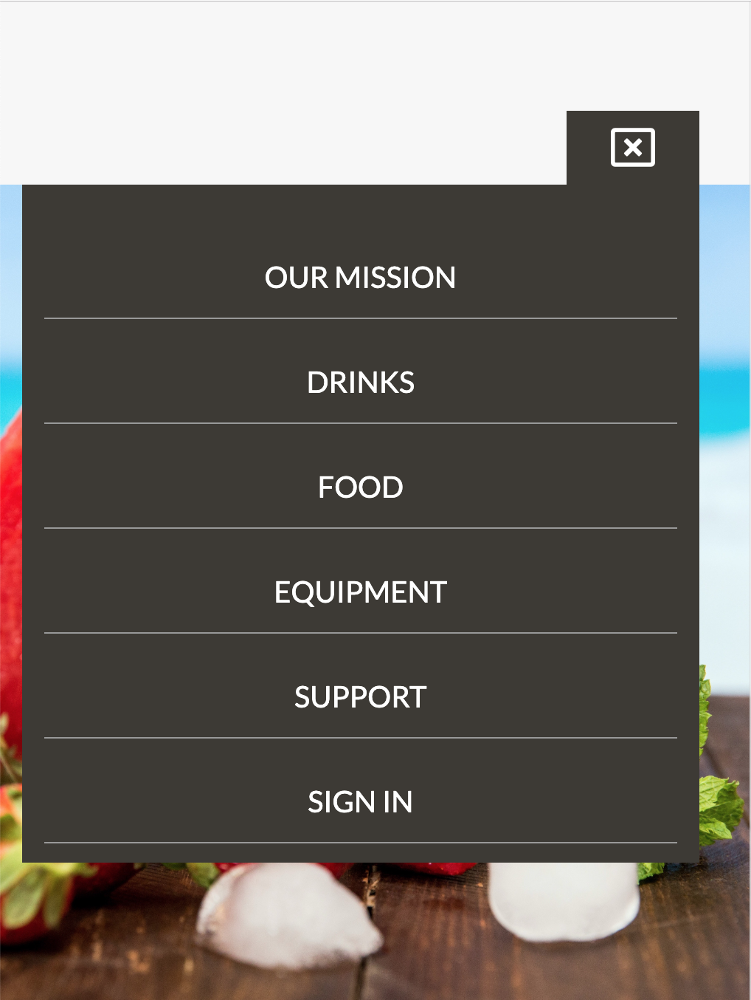

# CS 52 Lab 1 - Build a Landing Page
## Avery Vanacore 

dartmouth-cs52-19S/lab1-landingpage-averyv

### Description:
For the first lab, I mimicked different parts of the style and structure of the Starbucks and Blue Bottle Coffee landing pages to create my own landing page for StarBuch, a cafe that sells Kombucha.  I took the navigation bar, main image, and footer from Starbucks, and the article section from Blue Bottle Coffee.  I used at w3schools.com as a resource for HTML and CSS syntax and methods.

__What worked:__  I struggled considerably with flexboxes; originally, my code consisted of a mixture of random display:flex, display:in-line, and display: block.  After stepping away from the code and thinking more about the basic structure of the page, I was able to get the flex display to work.  Additionally, I am very proud of the hamburger menu in the smaller screen version of the webpage.  

__What didn't work:__  I put some time into trying to add the Link Headers (using the CSS Checkbox hack) but wasn't able to figure that out. 

### Screenshots of layout stage:
If the below images do not appear, they can be found in the images file with the names "html-screenshot-1.png," "html-screenshot-2.png," and "html-screenshot-3.png".

### Special features and (potential) extra credit by section:

__General:__

1. The cursor becomes a pointer when hovering over any link in the page.

__Navigation bar:__

1. On hover, the logo in the navigation bar expands and rotates.
2. On hover, the tabs in the navigation bar change color so that the background is black, and the text is white.
3. In the narrow version of the webpage, the navigation bar becomes a drop-down menu.  The menu label icon becomes an "X" when the menu is open.

If the below images do not appear, they can be found in the images file with the names "narrow-nav-bar-1.png" and "narrow-nav-bar-2.png."

__Hero image:__

1. On hover, the background color of the "MORE INFO" CTA becomes light pink.

__Article section:__

1. On hover, the two article images become more opaque and have rounded corners.
2. On hover, the "READ MORE" links under the article titles become darker blue.

__Contact section:__

1. On hover, the social media icons on the left expand in size.
2. On hover, the "JOIN MORE" button becomes more opaque.

__Footer:__

1. On hover, each item in the footer becomes more opaque.

### Original landing pages

__Starbucks__: <https://www.starbucks.com/>

*Took the nav bar, hero image, footer*

__Blue Bottle Coffee__: <https://bluebottlecoffee.com/>

*Took the article section*
